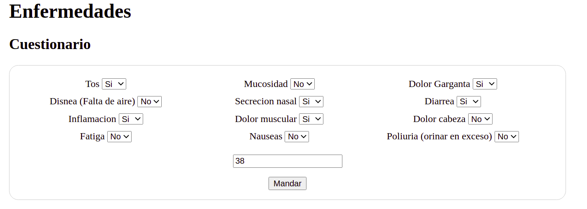

# Arbol de decisiones simple con scikit-learn
Una aplicacion sencilla donde puedes crear tu propo arbol de deciones, con este ejemplo con enfermedades de diferentes tipos.

## Insta€llar los requerimientos

```python
pip install -r requirements.txt
```

En caso que necesitas ver la creacion del arbol, necesitaras instalar graphviz

```bash
Sudo apt -y update && apt -y install graphviz
```
<hr>

# Muestra de la interfaz usando Flask
Una interfaz sencilla usando lo que es Flask para poder verlo de manera mas visual

<hr>
Dependiendo de las respuestas que desde en el cuestionario te devolvera una enfermedad que tenga en su base.

<hr>
